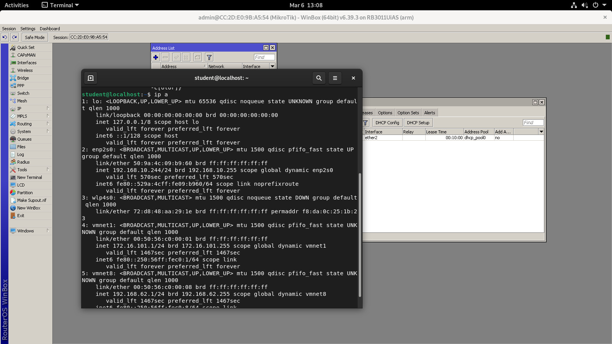
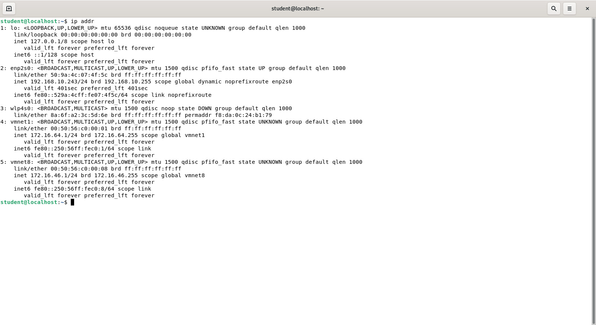
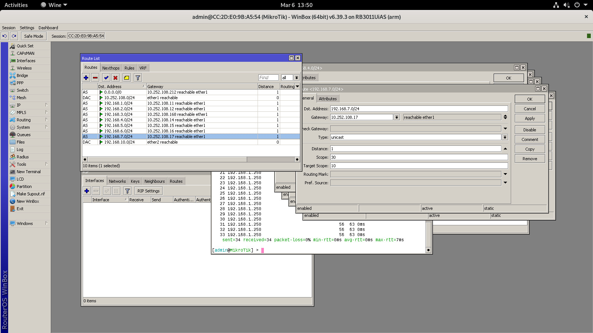
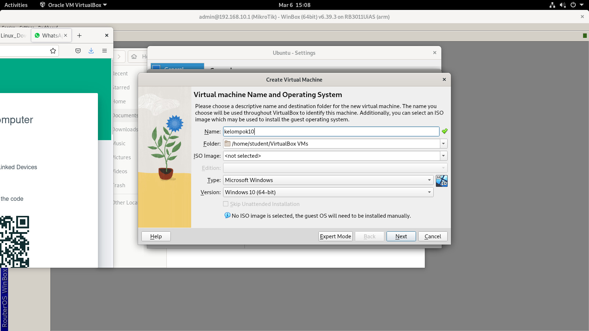
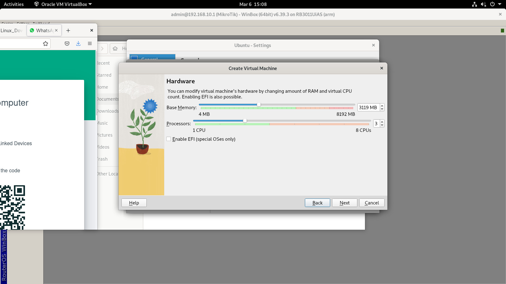
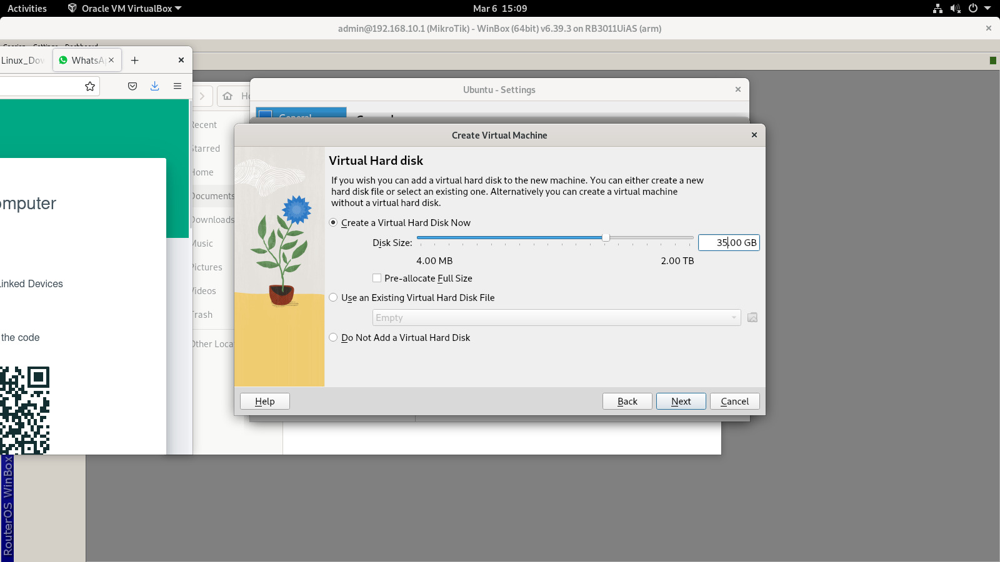
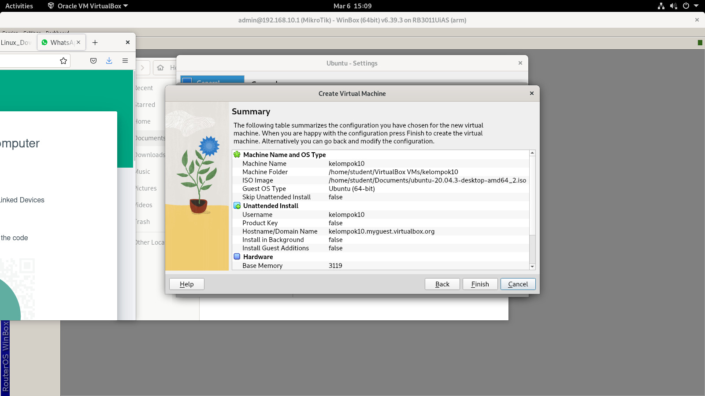
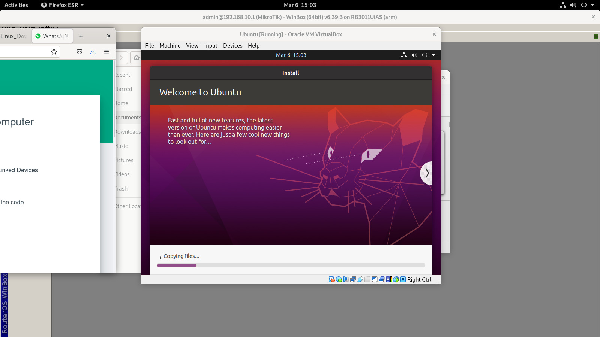

# Tugas Routing RB3011

**Kelompok 10** 

- Bagus Setiyo Pambudi (3121600034)

- Dzikri Mutawakkil (3121600035)

- Aditya Bagus Ferryanto (3121600048)

## Cek IP address tiap PC

Pastikan semua PC di meja anda mendapatkan IP address sesuai dengan gambar

## Catat IP address & ambil screenshot nya

IP address: 192.168.10.244

IP address: 192.168.10.243

## Akses Router RB3011 menggunakan winbox

akses router RB3011 menggunakan "winbox.exe" via wine yang telah terinstall

## Routing

Tambahkan routing table pada router sehingga bisa mengakses seluruh subnet pada 192.168.x.x

Tabel Routing pada winbox

Test ping pada komputer 192.168.x.x

## Instalasi Virtualbox dan Ubuntu

Install virtualbox dengan menggunakan petunjuk yang ada pada debian copy virtual machine yang sudah ada sebelumnya.

Ketika sudah menginstall virtualbox, setting virtual machine untuk menginstall ubuntu yang sudah disiapkan

 - Beri nama virtual machine dan OS yang akan diinstall

- Tentukan jumlah memori dan yang digunakan untuk virtual OS

- Tentukan jumlah storage dan yang digunakan untuk virtual OS

- Berikut adalah summary dari setting yang sudah disetting tadi

### Ubuntu

Setelah install virtualbox dan setting virtual machine, install OS ubuntu pada virtual machine yang sudah dibuat. Berikut tampilan awal OS Ubuntu setelah diinstall.

